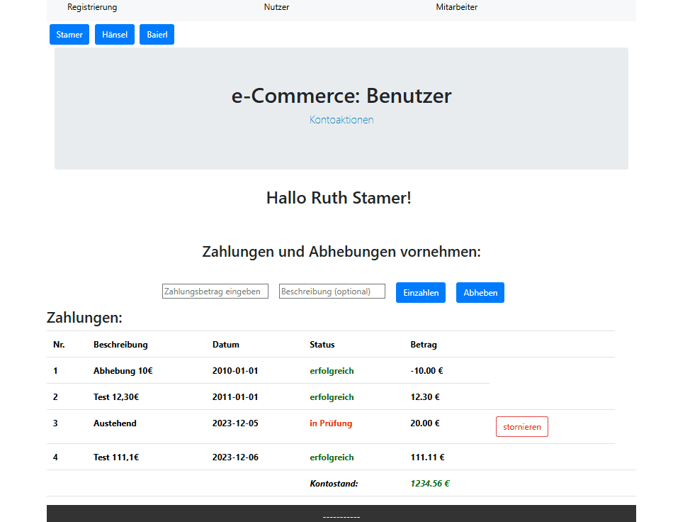

# Finance Dashboard – Angular Frontend


> Companion Backend Repository: [eCommerce-Backend](https://github.com/TillKaminski/ecommerce-backend)

This is the web frontend for a Finance Dashboard, developed as a rapid prototype during a technical coding challenge. It enables users to manage their accounts and provides employees with a dedicated interface for transaction authorization.

---

## 📺 Fullstack Workflow (Demo)

*The demo shows: User switching → Withdrawal request → Staff authorization → Live balance update.*

## ✨ Key Features
- **Role-Based Views**:
    - **User Dashboard**: View personal transaction history and initiate deposits or withdrawals.
    - **Employee Interface**: A comprehensive audit log for staff to review, filter, and approve pending transactions from all users.
- **Transaction Lifecycle**: Real-time feedback for withdrawal requests until authorized by a staff member.
- **Filtering:** Staff can filter transactions by date ranges (YYYY-MM-DD) to calculate sums and pending amounts.
- **Demo Quick-Switch**: Dedicated quick-access buttons to switch between different user profiles for easy demonstration.

## 🛠️ Technical Details
- **Component-Based Routing**: Utilizes the `RouterModule` with a centralized `<router-outlet>` to handle navigation between views without page reloads (SPA architecture).
- **Layout Architecture**: Implements a global layout with fixed Header/Footer components for a consistent user experience.
- **Responsive Design:** Built with **Bootstrap 4** and custom Modals (e.g., for registration) to ensure a clean and accessible interface.
- **REST Integration:** Communicates with a Spring Boot Backend via JSON RequestBodies.

## 🚀 Setup & Development

> **Note**: This frontend requires the [Backend](https://github.com/TillKaminski/ecommerce-backend) to run on port `8080`.

### Option 1: Quick Start (pre-built)

1. Download the latest build from the **Releases** section and extract the `.zip`.
2. Ensure [Node.js](https://nodejs.org/) is installed.
3. In the extracted folder (contains multiple files), run:
   ```bash
   # If you have an execution policy error on Windows, run: 
   # Set-ExecutionPolicy -ExecutionPolicy RemoteSigned -Scope CurrentUser
   npm install http-server # if not installed
   npx http-server -p 4200
   ```
4. Access the application: Navigate to `http://localhost:4200/`.

### Option 2: Development Setup

1. Clone the repository.
2. Install dependencies and start:
   ```bash
   npm install
   ng serve
   ```
3. Access the application: Navigate to `http://localhost:4200/`.

## License

This project is licensed under the MIT License - see the [LICENSE](./LICENSE) file for details.
